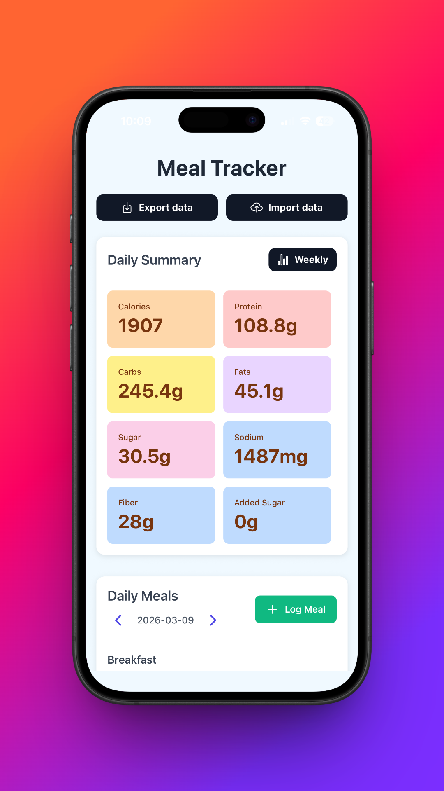
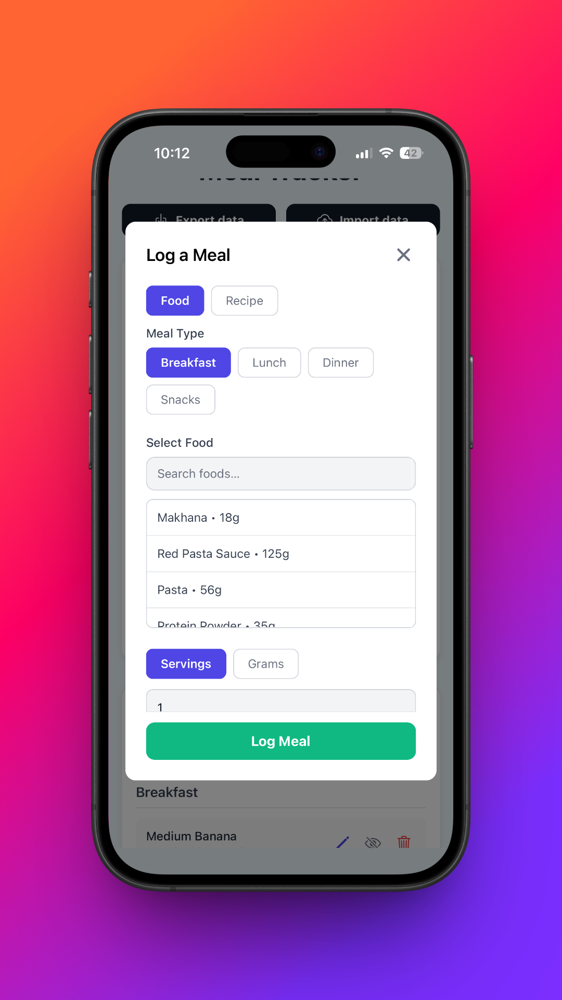
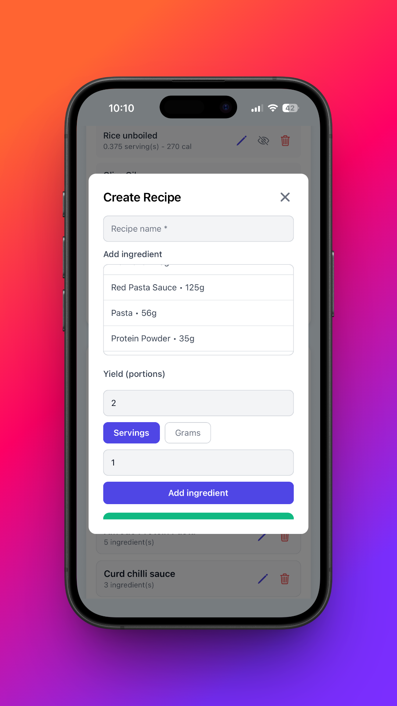
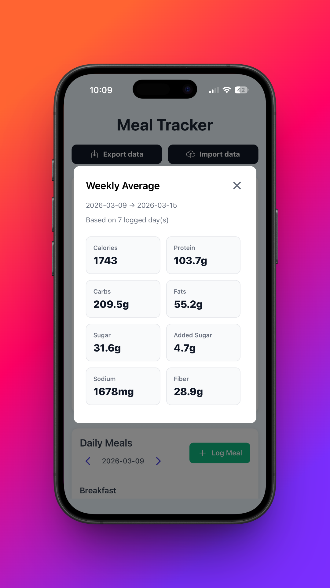

# 🍽️ Meal Tracker

A cross-platform mobile application built with **React Native (Expo)** for tracking foods, meals, and recipes with detailed nutrition analytics and flexible logging options.

---

## 📌 Overview

Meal Tracker helps users monitor their daily nutrition by logging foods, creating reusable recipes, and analyzing macro intake over time. The app is designed to handle real-world scenarios like portion-based eating, grams-to-servings conversion, and weekly nutrition tracking.

---

## 🚀 Features

- 📚 **Food Library Management**  
  Create, edit, and delete custom food items with full macro breakdown (calories, protein, carbs, fats, sugar, sodium, fiber, etc.)

- 🍱 **Meal Logging System**  
  Log meals by selecting foods and specifying intake via:
  - Servings  
  - Grams (auto-converted to servings)

- 🧩 **Recipe Builder**  
  - Combine multiple foods into reusable recipes  
  - Support for servings or grams per ingredient  
  - Dynamic **portion-based scaling** when consuming recipes  

- 📊 **Nutrition Analytics**  
  - Daily macro aggregation  
  - Weekly averages with intelligent day tracking  
  - Real-time updates based on enabled/disabled meals  

- 🔄 **Data Persistence & Migration**  
  - Local storage using AsyncStorage  
  - Automatic data migration for backward compatibility  

- 📤 **Import / Export Support**  
  - Export all data as JSON  
  - Import backups for portability and recovery  

- 🔍 **Search & Filtering**  
  - Quickly find foods and recipes  
  - Ingredient-level search support  

- ✏️ **Inline Editing & UX Enhancements**  
  - Edit foods and meals directly  
  - Toggle meal visibility  
  - Keyboard-aware modals and smooth interactions  

---

## 🛠️ Tech Stack

- **React Native (Expo)**
- **AsyncStorage** (local persistence)
- **Expo FileSystem, Sharing, DocumentPicker**
- **React Hooks (useState, useEffect, useMemo)**
- **Expo Router (navigation structure)**

---

## 🧠 Key Engineering Highlights

- ⚙️ **Grams ↔ Servings Conversion**  
  Converts user input dynamically based on serving size metadata.

- 📏 **Recipe Scaling Logic**  
  Implements portionFactor-based scaling to adjust nutrition based on consumed quantity.

- 🔄 **Backward-Compatible Data Migration**  
  Ensures older stored data remains usable after schema updates.

- 📊 **Efficient Aggregation**  
  Uses memoization (`useMemo`) for optimized daily and weekly macro calculations.

---

## 📱 Screenshots

| Home | Log Meal | Recipe Builder | Analytics |
|------|----------|----------------|----------|
|  |  |  |  |
---

## ⚙️ Setup & Installation

```bash
git clone https://github.com/YOUR_USERNAME/meal-tracker.git
cd meal-tracker
npm install
npx expo start
